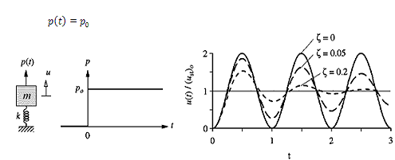

Here 6 types of Impulse forces are considered. They are,

**1. Step force:**

A step force jumps suddenly from zero to and stays constant at value. It is desired to determine the response of an undamped SDF system. Starting at rest to step force:

 
 

[Read More](doc/4.theory.pdf)
